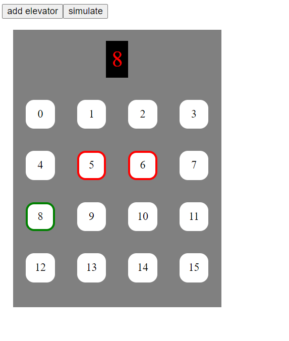

## Działanie algorytmu
algorytm wybiera najbliższe piętro w kierunku w którym porusza się winda(góra, dół), zatem najpierw wybierany jest kierunek windy w którym będzie się poruszać
a dopiero potem wybierane jest najbliższe piętro. Nie można wybrać piętra na którym znajduje się aktualnie winda.

* jeśli winda porusza się w górę to wybrane zostanie najbliższe piętro w tym kierunku mimo iż bliżej 
może znajdować się piętro w kierunku przeciwnym
* jeśli winda oczekuje czyli nie porusza się ani w góre ani w dół to winda zacznie poruszać 
się w kierunku piętra które zostało wybrane jako pierwsze a następnie znajdzie
najbliższe piętro na którym ma się zatrzymać
* gdy nie będzie już pięter na które ma sie udać winda w kierunku w którym porusza się winda 
to kierunek windy zostanie zmieniony i zostanie wybrane najbliższe piętro na które winda ma się udać
* winda przejdzie w stan oczekiwania gdy nie będzie musiała udać się na żadne piętro
a będzie oczekiwała na piętrze na którym się zatrzymała

## Przykład
Winda oczekuje na piętrze 3, wchodzi trzech ludzi, najpierw zostaje przyciśnięty przycisk 10
potem 0 a potem 5 -> winda zacznie poruszać się do góry bo jako pierwsze zostało wybrane piętro
które znajduję się wyżej, winda najpierw zatrzyma się na piętrze 5 potem 10  a na końcu piętrze 0,
jeśli na 5 piętrze ktoś wsiadł i wybrał piętro 11 to kolejność pięter będzie następująca 5 -> 10 -> 11 -> 0

## Oznaczenia na windzie

* przycisk "add elevator" dodaje winde
* przycisk "simulate" zaczyna symulacje
* zielona obwódka przy numerze oznacza że winda oczekuje na tym piętrze
* czerwona obwódka przy numerze oznacza że piętro zostało wybrane

## Uruchomienie aplikacji
By uruchomić aplikacje należy mieć zainstalowanego dockera
